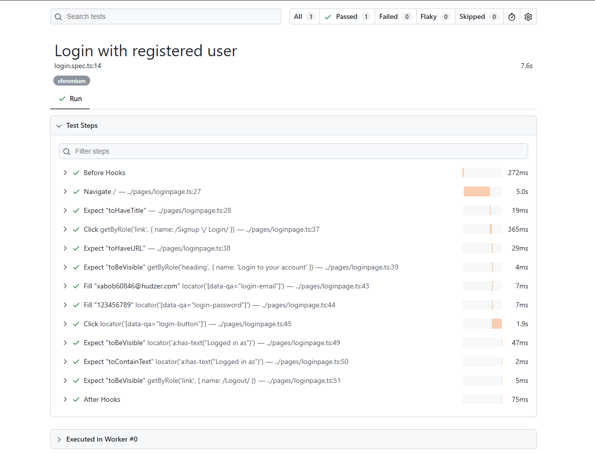

# Automation Exercise - Playwright Login Test

End-to-end login test for [Automation Exercise](https://www.automationexercise.com/), built with **Playwright** and **TypeScript**. The project uses a functional page-module structure.

## What the test does

1. Launches the website
2. Navigates to the Login page
3. Enters the registered email and password
4. Submits the login form
5. Verifies the login succeeded

## Tech stack

- [Playwright](https://playwright.dev/) (`@playwright/test`)
- TypeScript
- dotenv (environment variables)

## Project structure

```
.
├── pages/
│   └── loginpage.ts        # Locators and login actions (functions)
├── tests/
│   └── login.spec.ts       # Login test
├── playwright.config.ts    # Playwright configuration
├── package.json
├── .env                    # Credentials (not committed)
└── .gitignore
```

## Prerequisites

- [Node.js](https://nodejs.org/) 18 or later
- A registered account on [automationexercise.com](https://www.automationexercise.com/login)

## Setup

1. Clone the [repository](https://github.com/Asadulla1/automation-test):

```bash
   git clone https://github.com/Asadulla1/automation-test.git
   cd automation-test
```

2. Install dependencies and browsers:

   ```bash
   npm install
   npx playwright install
   ```

3. Create a `.env` file in the project root:

   ```env
   BASE_URL=https://www.automationexercise.com
   USER_NAME=your_registered_name
   USER_EMAIL=your_registered_email@example.com
   USER_PASSWORD=your_password
   ```

   > `USER_NAME` is the name you used at signup. The site logs in with **email and password**, and shows the name in the header after login.

## Run the tests

```bash
npm test                    # run all tests
npm run test:headed         # run with the browser visible
npx playwright test --ui    # interactive UI mode
npm run report              # open the HTML report
```

A successful run ends with `1 passed`.

## Scripts

Make sure `package.json` contains:

```json
"scripts": {
  "test": "playwright test",
  "test:headed": "playwright test --headed",
  "report": "playwright show-report"
}
```

## Troubleshooting

| Problem                                   | Fix                                                                                             |
| ----------------------------------------- | ----------------------------------------------------------------------------------------------- |
| "Your email or password is incorrect!"    | `USER_EMAIL` and `USER_PASSWORD` in `.env` must match the account you registered.               |
| Timeouts or blocked clicks                | Ads or a consent popup may cover the page. Re-run the test.                                     |
| Browser not found                         | Run `npx playwright install`.                                                                   |
| `Cannot find module '../pages/loginpage'` | Check that the file name and import use the same casing, then restart the TS server in VS Code. |

## Security note

Never commit your `.env` file. It is listed in `.gitignore`:

```
node_modules/
.env
test-results/
playwright-report/
```

## Author

Asadulla Al Mamun

## Result:


